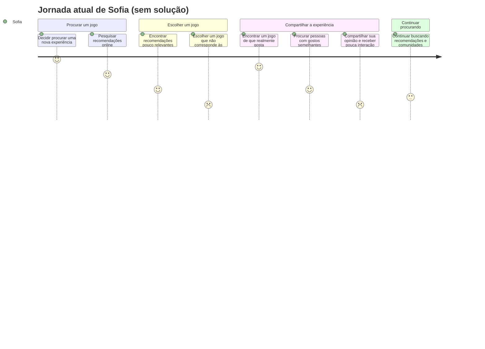

### 1) Cenário de Análise/Problema 

Sofia gosta de jogos que tenham histórias profundas, uma identidade artística marcante e uma experiência que realmente consiga envolvê-la. Como seu tempo para jogar é limitado, ela costuma pesquisar antes de decidir qual jogo comprar ou começar. Porém, quando procura recomendações, encontra principalmente anúncios, listas genéricas e comentários de comunidades muito amplas, que nem sempre levam em consideração o tipo de jogo que ela procura.

Em algumas ocasiões, Sofia acaba escolhendo um jogo que parecia interessante, mas percebe depois de algumas horas que ele não combina com seus gostos. Quando finalmente encontra um jogo que considera realmente bom, surge outro problema: ela tem dificuldade para encontrar pessoas com interesses semelhantes para compartilhar sua opinião e conversar sobre aquela experiência. Ela participa de comunidades online e pede indicações, mas muitas vezes recebe poucas respostas ou recomendações que não têm relação com suas preferências. Com isso, Sofia continua gastando tempo procurando jogos que possam agradá-la e sente que boas experiências acabam tendo pouca visibilidade.

### 2) Questões de Refinamento

* Com que frequência Sofia acaba escolhendo um jogo que não corresponde às suas expectativas?
* Quais características fazem com que ela considere um jogo adequado aos seus gostos?
* Em quais comunidades ou lugares online ela costuma procurar recomendações?
* Por que as recomendações que recebe costumam ser pouco relevantes para ela?
* Sofia já tentou procurar pessoas com gostos semelhantes em comunidades específicas?
* O problema acontece somente na descoberta de novos jogos ou também quando ela tenta compartilhar suas opiniões?
* Outras pessoas com gostos específicos enfrentam a mesma dificuldade?
* O que faz com que Sofia considere uma recomendação realmente confiável?

### 3) Refinamento do Cenário de Análise/Problema

Sofia costuma pesquisar jogos antes de comprá-los porque considera seu tempo de lazer limitado e prefere investi-lo em experiências que realmente correspondam aos seus interesses. Nas últimas vezes em que procurou um jogo novo, utilizou comunidades online e recomendações de outros jogadores, mas encontrou principalmente indicações genéricas ou conteúdos voltados para jogos populares. Como seus interesses são mais específicos, muitas dessas recomendações não correspondiam ao tipo de narrativa ou experiência que procura.

Ela já tentou pedir indicações diretamente em comunidades online, mas frequentemente recebe poucas respostas ou sugestões que não levam em consideração suas preferências. Quando encontra um jogo de que realmente gosta, também sente dificuldade para encontrar pessoas interessadas em discutir aquele tipo de experiência. Dessa forma, o problema não está apenas em encontrar jogos novos, mas em encontrar **recomendações relevantes e pessoas com interesses semelhantes** para compartilhar experiências e opiniões.

### 4) Contexto de Uso

* Sofia utiliza principalmente ambientes digitais para pesquisar jogos, acompanhar discussões e compartilhar suas opiniões.
* Costuma acessar comunidades online por computador ou celular, especialmente durante momentos de lazer.
* O contexto social é formado por comunidades de jogadores com interesses variados, nas quais jogos populares tendem a receber mais atenção.
* Sofia possui interesses específicos, principalmente relacionados a narrativas profundas e aspectos artísticos dos jogos.
* Antes de escolher um jogo, ela considera importante encontrar informações e opiniões de outros jogadores.
* O problema costuma aparecer quando há muitas opções disponíveis, mas poucas informações realmente relacionadas aos seus gostos.
* Depois de encontrar um jogo que aprecia, ela também procura espaços onde possa compartilhar sua experiência com pessoas que tenham interesses semelhantes.

### 5) Jornada do Usuário (atual, sem solução) — Sofia

| Etapa                                 | O que acontece                                                                                                                                                                   | Estado emocional |
| :------------------------------------ | :------------------------------------------------------------------------------------------------------------------------------------------------------------------------------- | :--------------- |
| 1. Decide procurar um jogo novo       | Sofia quer encontrar uma nova experiência para jogar e procura algo que combine com seus gostos.                                                                                 | Animada          |
| 2. Pesquisa recomendações             | Ela procura indicações em comunidades e conteúdos online, mas encontra principalmente recomendações genéricas e jogos populares.                                                 | Esperançosa      |
| 3. Avalia as opções                   | Sofia tenta descobrir se os jogos recomendados possuem as características que procura, mas tem dificuldade para encontrar informações realmente relevantes para seus interesses. | Em dúvida        |
| 4. Escolhe um jogo                    | Depois de pesquisar, escolhe uma opção que parece interessante, mas percebe posteriormente que o jogo não corresponde às suas expectativas.                                      | Frustrada        |
| 5. Encontra um jogo de que gosta      | Quando finalmente encontra uma experiência que considera boa, procura outras pessoas interessadas em conversar sobre ela.                                                        | Animada          |
| 6. Tenta compartilhar sua experiência | Sofia participa de comunidades online e procura pessoas com gostos semelhantes, mas suas publicações têm pouco alcance ou recebem pouca interação.                               | Decepcionada     |
| 7. Continua procurando                | Mesmo após essas experiências, ela continua procurando comunidades e recomendações mais compatíveis com seus interesses.                                                         | Cansada          |

