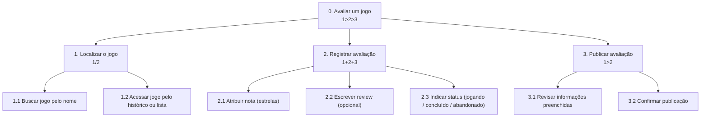
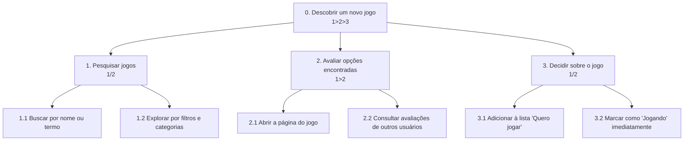

# Análise de Tarefas

> **_NOTE:_**: Enquanto o Cenário de Análise/Problema descreve a situação em prosa, a Análise de Tarefas modela formalmente como o usuário executa as funcionalidades mais importantes da interface/produto. Isso alimenta diretamente a Arquitetura de Informação e o Fluxo do Usuário na próxima etapa.

Foram modeladas **2 HTAs** e **2 GOMS**, cobrindo 4 funcionalidades diferentes da plataforma. A escolha das funcionalidades se baseou diretamente nos dados da pesquisa com usuários (documento 03) e nas personas (documento 04):

* **Avaliar um jogo (HTA)** — funcionalidade ligada à dor mais citada no questionário (45 de 82 participantes apontaram o processo de avaliação como demorado).
* **Descobrir um novo jogo (HTA)** — funcionalidade central da frustração da Sofia, relacionada à dificuldade de encontrar recomendações relevantes.
* **Criar e organizar uma lista personalizada (GOMS)** — funcionalidade de catalogação, referência direta ao Letterboxd (64,6% dos participantes já usam listas de desejos).
* **Seguir um usuário e interagir com uma avaliação (GOMS)** — funcionalidade social, referência ao Reddit e à dor da Sofia de não encontrar pessoas com gostos semelhantes.

---

## HTA 1 — Avaliar um jogo

**Funcionalidade**: permitir que o usuário registre uma avaliação de um jogo que jogou, atribuindo nota, escrevendo uma review opcional e indicando o status (jogando, concluído ou abandonado), publicando tudo de forma rápida.



* **Plano 0 (`1>2>3`)**: o usuário primeiro localiza o jogo, depois registra a avaliação, e só então publica — nessa ordem, já que não é possível avaliar sem antes ter o jogo aberto.
* **Plano 1 (`1/2`)**: o jogo pode ser localizado por busca direta ou por um caminho já percorrido antes (histórico/lista) — o usuário escolhe **um** dos dois caminhos, não os dois.
* **Plano 2 (`1+2+3`)**: nota, review e status ficam no mesmo formulário e podem ser preenchidos em qualquer ordem; a review inclusive é opcional, respondendo diretamente à dor de "processo demorado" identificada na pesquisa — o usuário pode avaliar só com a nota, sem escrever nada.
* **Plano 3 (`1>2`)**: o usuário revisa o que preencheu antes de confirmar a publicação.

---

## HTA 2 — Descobrir um novo jogo

**Funcionalidade**: permitir que o usuário pesquise ou explore jogos por filtros, consulte avaliações de outros usuários para decidir se o jogo combina com seu gosto, e então registre essa decisão (adicionando à lista de "quero jogar" ou já começando a jogar).



* **Plano 0 (`1>2>3`)**: o usuário primeiro pesquisa, depois avalia as opções encontradas, e só então decide o que fazer com o jogo.
* **Plano 1 (`1/2`)**: a pesquisa pode ser feita digitando um termo direto ou explorando por filtros/categorias — caminho alternativo, escolhido conforme o quão específico é o que o usuário procura (responde diretamente à dificuldade da Sofia com recomendações genéricas).
* **Plano 2 (`1>2`)**: só é possível consultar as avaliações depois de abrir a página do jogo.
* **Plano 3 (`1/2`)**: o usuário escolhe entre guardar o jogo para depois ou começar a jogar imediatamente — nunca os dois ao mesmo tempo.

---

## GOMS 1 — Criar uma lista personalizada e adicionar jogos a ela

**Funcionalidade**: permitir que o usuário crie uma lista própria (ex.: "Jogos favoritos de RPG") e adicione jogos a ela, tanto durante a navegação quanto a partir da página de um jogo específico.

```
GOAL 0: criar a lista "Jogos favoritos de RPG" e adicionar jogos a ela

  GOAL 1: criar uma nova lista
    METHOD 1.A: criar pela aba de listas do perfil
      OP. 1.A.1: tocar na aba "Minhas listas"
      OP. 1.A.2: tocar no botão "Nova lista"
      OP. 1.A.3: digitar o nome da lista
      OP. 1.A.4: confirmar a criação

  GOAL 2: adicionar jogos à lista
  (repetir GOAL 2 para cada jogo que o usuário quiser adicionar)

    METHOD 2.A: adicionar durante a navegação/busca
    (SEL. RULE: usuário ainda está explorando e não abriu a página do jogo)
      OP. 2.A.1: buscar o jogo desejado
      OP. 2.A.2: tocar no ícone "adicionar à lista" no resultado da busca
      OP. 2.A.3: selecionar a lista criada

    METHOD 2.B: adicionar a partir da página do jogo
    (SEL. RULE: usuário já está na página do jogo)
      OP. 2.B.1: tocar no botão "adicionar à lista" na página do jogo
      OP. 2.B.2: selecionar a lista criada
```

Essa funcionalidade responde diretamente ao dado do questionário de que 64,6% dos participantes já usam listas de desejos, e aos dois métodos alternativos do GOAL 2 refletem que a decisão de catalogar um jogo pode acontecer em dois momentos distintos da jornada: ainda pesquisando, ou já dentro da página do jogo.

---

## GOMS 2 — Seguir um usuário e interagir com uma avaliação

**Funcionalidade**: permitir que o usuário encontre o perfil de alguém com gostos semelhantes (a partir de uma avaliação relevante ou por busca direta) e passe a seguir esse usuário.

```
GOAL 0: seguir um usuário com gostos semelhantes

  GOAL 1: encontrar o perfil do usuário

    METHOD 1.A: acessar pelo autor de uma avaliação
    (SEL. RULE: usuário encontrou uma review relevante na página de um jogo)
      OP. 1.A.1: tocar no nome/avatar do autor da avaliação
      OP. 1.A.2: aguardar a abertura do perfil

    METHOD 1.B: buscar pelo nome de usuário
    (SEL. RULE: usuário já sabe o nome ou apelido de quem procura)
      OP. 1.B.1: tocar no campo de busca
      OP. 1.B.2: digitar o nome de usuário
      OP. 1.B.3: tocar no resultado correspondente

  GOAL 2: seguir o usuário
      OP. 2.1: tocar no botão "Seguir" no perfil
      OP. 2.2: verificar a confirmação visual (botão muda para "Seguindo")
```

Essa funcionalidade responde à dor da Sofia de ter dificuldade para encontrar pessoas com interesses semelhantes: o Método 1.A é o caminho mais provável, já que nasce do próprio conteúdo (a review), e não de uma busca às cegas por nome, que costuma ser o ponto fraco nas comunidades genéricas que ela já usa.
